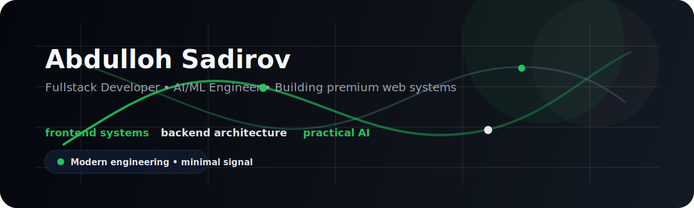

# Abdulloh Sadirov

  

  

  
  
  
  

  
  
  

  
  

  <strong>Fullstack Developer • AI/ML Engineer</strong>

  Building scalable AI-powered web systems with modern frontend, backend, database, and DevOps technologies.

  I design and build modern digital systems using React, Django, FastAPI, PostgreSQL, Docker, and AI/ML.

  

## About Me

I design and build software with a systems mindset: product-grade frontend, reliable backend services, scalable data layers, and practical AI integrations that solve real problems.

- I work at the intersection of React UX, Python backend engineering, and AI-assisted product development.
- I care about clean abstractions, maintainable architecture, and visual restraint.
- I aim to make developer-facing and user-facing systems feel equally polished.

## Positioning

`Fullstack Developer • AI/ML Engineer • React Engineer • Backend Developer • System Builder`

## Tech Stack

  

  

  

## Frontend

- React, Vue, JavaScript, TypeScript, TailwindCSS, Sass/SCSS
- Responsive UI systems, component architecture, REST API integration
- Clean interfaces with product-grade layout and interaction quality

## Backend

- Python, Django, Django REST Framework, FastAPI
- REST API design, HTTP workflows, JWT authentication
- Service structure that stays readable and maintainable under growth

## Databases

- PostgreSQL for relational systems and production-minded data design
- MongoDB for document-oriented use cases and flexible data modeling
- Focus on schema clarity, query sanity, and real system behavior

## DevOps

- Dockerized applications and environment consistency
- Nginx, HTTPS, CI/CD, and deployment workflows
- Linux-based operational thinking for practical delivery

## Current Focus

- Shipping fullstack products with strong UI clarity and backend reliability.
- Building AI-enabled workflows and lightweight ML systems with practical value.
- Improving portfolio-grade repositories that communicate architecture, not just code.

## AI / ML Interests

- Applied machine learning for real product workflows
- Deep learning as part of usable systems, not isolated demos
- AI tooling, model integration, and backend orchestration
- Human-centered interfaces for technically complex products

## Backend Systems

- FastAPI and Django services with clean boundaries
- PostgreSQL-backed systems with sane schema design
- REST APIs that are documented, testable, and deployable
- Dockerized delivery with production-oriented thinking

  

## Engineering Signal

<!-- profile-refresh:start -->
- Last automated profile refresh: 2026-07-13 19:45 UTC
- Active profile mode: Fullstack systems, AI-enabled products, premium engineering presentation
- Automation status: README signal and contribution snake are enabled
<!-- profile-refresh:end -->

## GitHub Analytics

  
  

  

  

  

## Featured Projects

| Current idea | Recommended name | Positioning |
| --- | --- | --- |
| `EduTC` | `edutc-platform` | Primary product and strongest domain-specific build |
| Fullstack AI project | `ai-system-lab` | Proof of applied AI architecture and product thinking |
| React/Tailwind project | `react-ui-lab` | Frontend craft, motion restraint, component quality |
| Backend API system | `fastapi-core` | Backend credibility with docs, testing, and clean service design |
| Dockerized project | `docker-stack-starter` | Deployment-minded engineering and system packaging |
| Portfolio website | `sadirov-dev` | Personal brand hub and narrative portfolio |

## Repository Branding Recommendations

### EduTC
- Description: `Education-focused product platform built with modern fullstack architecture and product-first UX.`
- Topics: `education`, `fullstack`, `react`, `python`, `postgresql`, `docker`
- README upgrades: product overview, screenshots, architecture diagram, setup steps, deployment notes

### Fullstack AI Project
- Suggested repo name: `ai-system-lab`
- Description: `Experimental fullstack AI system combining product UX, backend orchestration, and model-powered workflows.`
- Topics: `ai`, `ml`, `fastapi`, `react`, `llm`, `fullstack`
- README upgrades: problem statement, system flow, model usage, result demo, roadmap

### React / Tailwind Project
- Suggested repo name: `react-ui-lab`
- Description: `Polished frontend project focused on premium interface design, responsiveness, and component architecture.`
- Topics: `react`, `tailwindcss`, `frontend`, `ui`, `responsive`, `design-system`
- README upgrades: screenshots, component strategy, performance notes, live demo link

### Backend API System
- Suggested repo name: `fastapi-core`
- Description: `Production-oriented backend API with clean service layers, authentication, and database integrations.`
- Topics: `fastapi`, `python`, `api`, `postgresql`, `backend`, `docker`
- README upgrades: endpoints, auth flow, data model, testing, environment setup

### Dockerized Project
- Suggested repo name: `docker-stack-starter`
- Description: `Containerized application stack showing deployment readiness, environment structure, and operational clarity.`
- Topics: `docker`, `devops`, `deployment`, `nginx`, `containers`, `linux`
- README upgrades: service map, compose setup, infra notes, deployment checklist

### Portfolio Website
- Suggested repo name: `sadirov-dev`
- Description: `Personal portfolio and developer brand site for showcasing systems, projects, and engineering direction.`
- Topics: `portfolio`, `react`, `frontend`, `branding`, `vercel`, `developer-portfolio`
- README upgrades: screenshots, live URL, case studies, writing section, contact section

  

## Development Philosophy

> Strong software should look intentional, feel fast, read clearly, and stay maintainable under growth.

## Contact

- GitHub: [github.com/sadirovabduloh-ux](https://github.com/sadirovabduloh-ux)
- Portfolio: `sadirov.dev` when live
- LinkedIn: add your public LinkedIn URL in GitHub profile settings
- Telegram: add your public Telegram username link in GitHub profile settings
- Instagram: add your public Instagram URL in GitHub profile settings

## Profile Branding Targets

- Bio: `Fullstack Developer • AI/ML Engineer`
- Location: `Kyrgyzstan`
- Website: `sadirov.dev` or portfolio placeholder until launch
- Pinned repositories: `edutc-platform`, `ai-system-lab`, `react-ui-lab`, `fastapi-core`, `docker-stack-starter`, `sadirov-dev`

## Optional Integrations

- Spotify / Now Playing: add only if you want personality in the profile without hurting the technical tone
- WakaTime: add only after you have a public WakaTime profile, otherwise skip it to avoid weak or empty widgets
